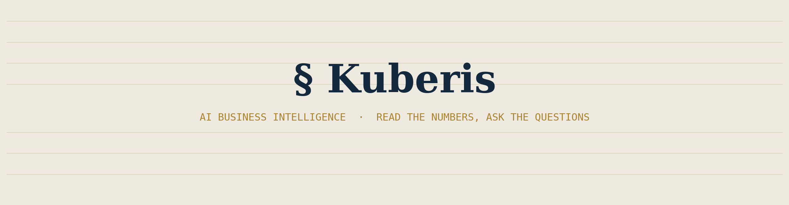
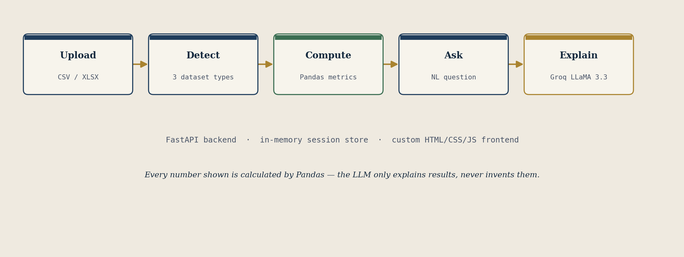

<div align="center">




[](https://www.python.org/)
[](https://fastapi.tiangolo.com/)
[](https://www.langchain.com/)
[](https://groq.com/)
[](https://pandas.pydata.org/)
[](https://render.com/)
[](#license)

[**Live Demo**](#) · [**Report a Bug**](#) · [**Request a Feature**](#)

</div>

<br>

## Overview

**Kuberis** is an AI-powered business intelligence agent that turns a raw spreadsheet into an interactive analyst. Drop in a CSV or Excel file, and Kuberis reads it, classifies it, calculates every headline metric it can find, and sits ready to answer natural-language questions about it — grounded entirely in the data you gave it.

The core design principle: **Pandas calculates, the LLM explains.** Every number shown in the UI is computed directly from your dataset. The language model (Groq's Llama 3.3 70B) is never asked to invent a figure — only to turn a Pandas result into a clear, business-friendly answer, explanation, and recommendation.

<br>

## How it works

<div align="center">

</div>

| Stage | What happens |
|---|---|
| **1. Upload** | User submits a `.csv` or `.xlsx` file through the frontend, or loads the bundled sample dataset |
| **2. Detect** | Column-name heuristics classify the dataset as **Sales**, **Financial**, or general **Business Intelligence** |
| **3. Compute** | A Pandas-driven metrics engine calculates 7+ business KPIs — total sales, revenue, profit, expenses, average order value, customer count, product count — wherever a matching column exists |
| **4. Ask** | The user asks a question in plain English (*"which region had the highest sales?"*) |
| **5. Explain** | An intent-detection layer routes the question to the correct Pandas computation; Groq's Llama 3.3 70B, via LangChain's structured output, turns the raw result into an answer, explanation, and recommendation |

<br>

## Features

- 📂 **Flexible ingestion** — accepts CSV and Excel files of any shape; no schema configuration required
- 🔍 **Automatic dataset classification** — detects Sales, Financial, or general BI datasets from column names alone
- 📊 **Zero-hallucination metrics** — every headline figure is a real Pandas calculation, never an LLM estimate
- 💬 **Natural-language Q&A** — ask questions like *"top 5 products"* or *"how many customers?"* and get grounded answers
- 🧭 **Intent-aware routing** — 8+ supported query types (regional performance, top products, financial totals, open-ended recommendations)
- 🗂️ **Data quality diagnostics** — automatic detection of missing values and duplicate rows
- 🎨 **Custom-built interface** — a hand-designed FastAPI + HTML/CSS/JS frontend, not a generic dashboard template
- ☁️ **One-command deploy** — ships as a single FastAPI service, ready for Render or any ASGI host

<br>

## Tech stack

<div align="center">

| Layer | Technology |
|---|---|
| **Backend** |    |
| **Data processing** |   |
| **AI / LLM orchestration** |   |
| **Frontend** |    |
| **Deployment** |  |

</div>

<br>

## Project structure

```
kuberis/
├── main.py              # FastAPI app — routes, session store, request/response models
├── config.py             # App settings + Groq LLM client factory
├── data_loader.py         # CSV/Excel parsing, dataset classification, metric calculation
├── analyzer.py             # Intent detection, analysis execution, LLM-backed explanation
├── models.py                # Pydantic schemas (DatasetSummary, BusinessMetrics, AnalysisResponse)
├── prompts.py                 # LangChain prompt templates
├── requirements.txt             # Python dependencies
├── filtered_sales.csv            # Bundled sample dataset
└── static/
    ├── index.html                 # Frontend markup
    ├── style.css                    # Ledger-inspired visual design
    └── app.js                        # Upload flow, dashboard rendering, Q&A chat
```

<br>

## Getting started

### Prerequisites

- Python 3.10+
- A free [Groq API key](https://console.groq.com/keys)

### Installation

```bash
# Clone the repository
git clone https://github.com/<your-username>/kuberis.git
cd kuberis

# Install dependencies
pip install -r requirements.txt

# Set your API key
echo "GROQ_API_KEY=your_key_here" > .env

# Run the app
uvicorn main:app --reload
```

Open **http://127.0.0.1:8000** in your browser.

<br>

## API reference

| Method | Endpoint | Description |
|---|---|---|
| `GET` | `/api/health` | Health check — confirms the server is running and the API key is set |
| `POST` | `/api/upload` | Upload a CSV/Excel file; returns metrics, summary, and a preview |
| `POST` | `/api/sample` | Load the bundled sample dataset |
| `POST` | `/api/ask` | Submit a natural-language question against an active session |

<br>

## Deployment

Kuberis ships as a single ASGI service — deploy anywhere that runs Python.

**Render**
```
Build Command:  pip install -r requirements.txt
Start Command:  uvicorn main:app --host 0.0.0.0 --port $PORT
```
Set `GROQ_API_KEY` as an environment variable in the Render dashboard.

<br>

## Design philosophy

Kuberis's interface draws on the visual language of a physical ledger book — ruled paper lines, a navy-and-brass palette, serif headings, and monospaced figures — rather than a generic dashboard template. The goal was an interface that feels purpose-built for reading business records, not a stock component library.

<br>

## Roadmap

- [ ] Persistent session storage (currently in-memory, resets on server restart)
- [ ] Multi-file comparison (analyze two datasets side by side)
- [ ] Exportable PDF/Word reports of a Q&A session
- [ ] Chart generation for trend-based questions

<br>

## License

Distributed under the MIT License. See `LICENSE` for details.

<br>

<div align="center">

Built by [Aryan](https://github.com/WnagarAryan) · [GitHub](https://github.com/WnagarAryan) · [Portfolio](#)

</div>
